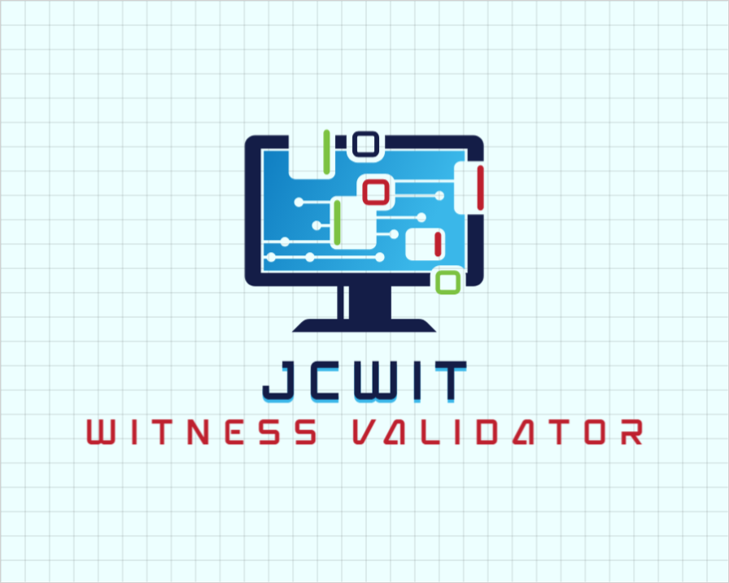
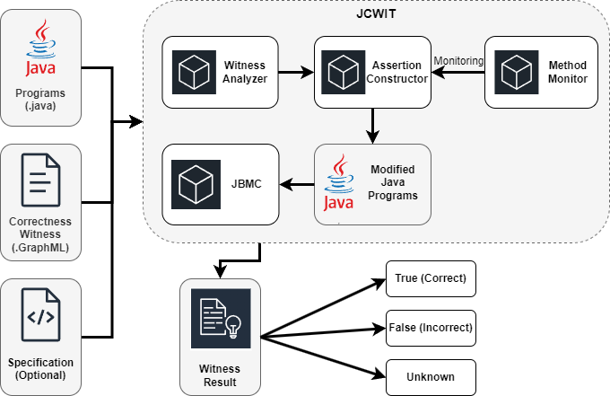

# JCWIT


# Description

JCWIT is a  correctness-witness validator used for validating result output by Java verifiers. It takes a Java program with safety properties and the corresponding correctness witnesses to validate the verification results. JCWIT extracts the invariants from the correctness witnesses and re-injects them as assertion statements into the original program using the Mockito framework. A Java model checker is used to re-verify these assertion statements to check whether they are hold in the original Java program. In addition, JCWIT determines the completeness of the correctness witnesses by checking for the existence of cycles.

# Architecture

**a. jcwit.py** - This file is the entry file and is responsible for parsing the input (witnesses), outputting the results and making calls to the relevant methods.

**b. validationharness.py** - This file is responsible for building the validation harness and utilizing JBMC for validation to output the validation results..

**c. witnessvalidation.py** - This file is responsible for checking that the CFG in the correctness witness whether covers all the behaviour of the program.

**d. monitorprocessor.py** - This file is responsible for monitoring the methods, which will assist when assertions are inserted.

**e. propertyvalidation.py** - The core algorithmic file of the tool is responsible for extracting the corresponding invariants from the witnesses and integrating them into assertions, which are then injected in the appropriate places. 

**f. MethodCallMonitor.java** - This java file will monitor the methods and provide support for tools to be able to selectively enforce assertions.

The following diagram depicts the software architecture of JCWIT.



# Instructions

Specific steps on how to use JCWIT and the third-party libraries that need to be installed (mandatory) are listed below.

1. Start by obtaining JCWIT from Github with the given command:

   ```
   git clone https://github.com/Chriszai/JCWIT.git
   ```

2. Installing Python 3 is necessary for this project. Here you can find a installation instructions for setting up Python on several platforms
   https://realpython.com/installing-python/ or use the command given below:

   ```
   $ sudo apt-get update
   $ sudo apt-get install python
   ```

   If you want to install a specific version of Python, add the specific version after "Python", for example:

   ```
   $ sudo apt-get install python3.8
   ```

3. The additional third-party packages required by this Python script are as follows (mandatory):<br>
   • subprocess<br>
   • sys<br>
   • networkx<br>
   • random<br>
   • javalang<br>
   • subprocess

   Please note that **networkx** and **javalang** needs to be installed separately; NetworkX requires Python 3.8, 3.9 or 3.10.  The specific installation instructions are as follows：

   https://www.osgeo.cn/networkx/install.html, Or you can simply install it with the Linux command:

   ```
   pip install networkx[default]
   ```

   And the Javalang package is available at https://github.com/c2nes/javalang, or you can install it with command:

   ```
   pip install javalang
   ```

4. JBMC supports multiple platforms including Ubantu, macOS and Windows and Docker. Different versions for different platforms can be found on the official GitHub. The GitHub link for JBMC is shown below:

   https://github.com/diffblue/cbmc/releases.

   On Ubuntu, install CBMC by downloading the *.deb package below for your version of Ubuntu and install with

   ```
   # Ubuntu 20:
   $ dpkg -i ubuntu-20.04-cbmc-5.95.1-Linux.deb
   ```

5. Next, use the following command to validate the selected Java file:

   ```
   ./jcwit.py --witness <path-to-witnesses>/*.graphml <path-to-java-files>/*.java
   ```

   where the parameter *.graphml indicates the witness to be validated, and *.java indicates a series of Java programs to be validated or all Java files in
   the directory of files to be validated.

   ```
   ./jcwit.py --version
   ```

   This command is used to check the version of the script currently in use.

# Outputs

The verification process will output all the invariants extracted from the witnesses and print them after the invariants have been successfully injected into the program to be verified.

The example java program:

```java
static void isTriangle(int a, int b, int c){
    int x;
    if(a > b && a > c){
        x = a * a;
    } else if (b > a && b > c) {
        x = b * b;
    } else x = c * c;
    int y = a * a + b * b + c * c;
    if(2 * x == y){
        assert true;
    } 
    else assert false;
}
public static void main(String[] args) {
    isRightTriangle(5,4,3);
}
```

The output of example program is shown below.

```
PS E:\project\correctnessVerifier\jcwit\src> python3 jcwit.py --witness witness Test.java 
Invariant x = 25 has been inserted as assertion in the program. SUCCESS
Invariant y = 50 has been inserted as assertion in the program. SUCCESS
JBMC version 5.90.0 (cbmc-5.90.0) 64-bit x86_64 windows

** 0 of 37 failed (1 iterations)
VERIFICATION SUCCESSFUL
```

